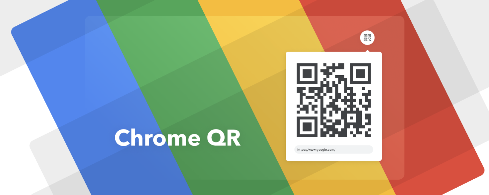

<p align="center">
  
</p>
<h1 align="center">
  Chrome QR
</h1>
<p align="center">
  Quickly generate a QR code from the currently 
  open website with this nifty extension designed
  to fit perfectly with Chrome’s UI.
</p>

## Why?
I often find myself having to open up a link on my (or worse - someone's) mobile device, yet I found no similar extension that looks good enough and goes in-line with Chrome's overall UI (in an ocean of others), so I made something that meets my needs.

## Install
Available on [Google Web Store](https://chrome.google.com/webstore/detail/chrome-qr/knbijmiadgdcdfodaeeapgngekobjbdj).

## Build
```
yarn || npm install
yarn build || npm build
```
To run the extension locally open Chrome, go to `chrome://extensions`, make sure the "Developer mode" checkbox is on, click "Load unpacked" and link to the previously built directory.

## License
Licensed under the MIT License, Copyright © 2019 Marko Radak.  
See [license](LICENSE) for more information.